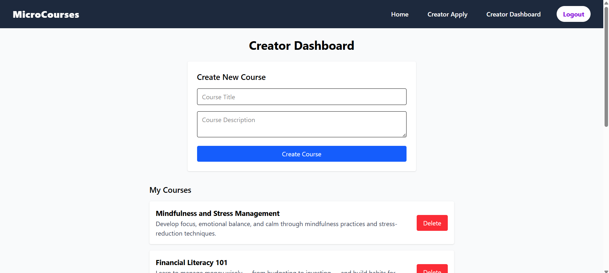
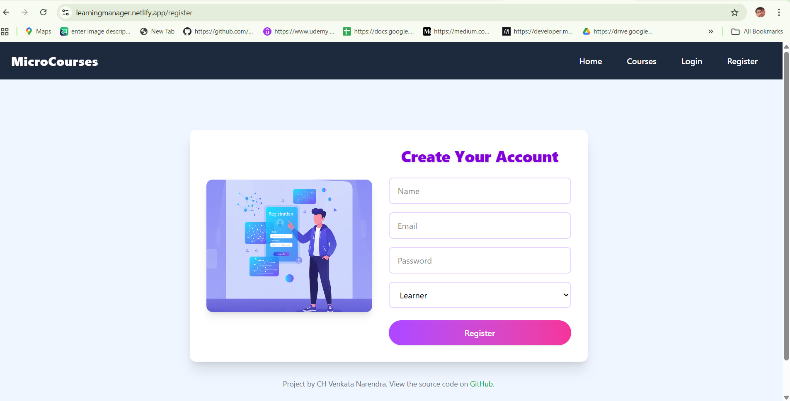
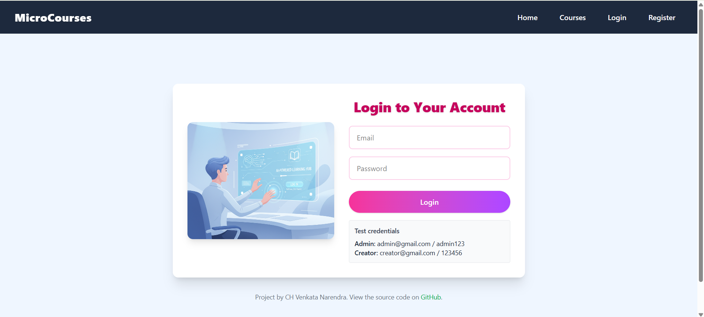
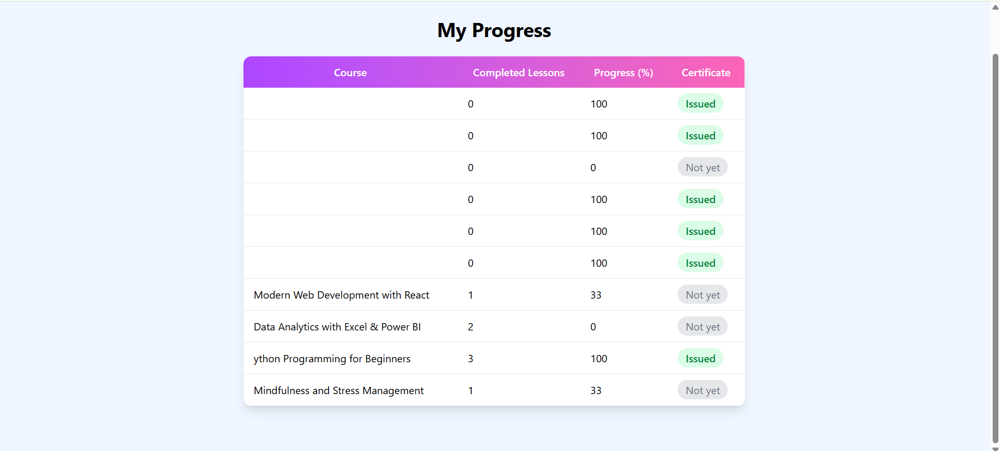
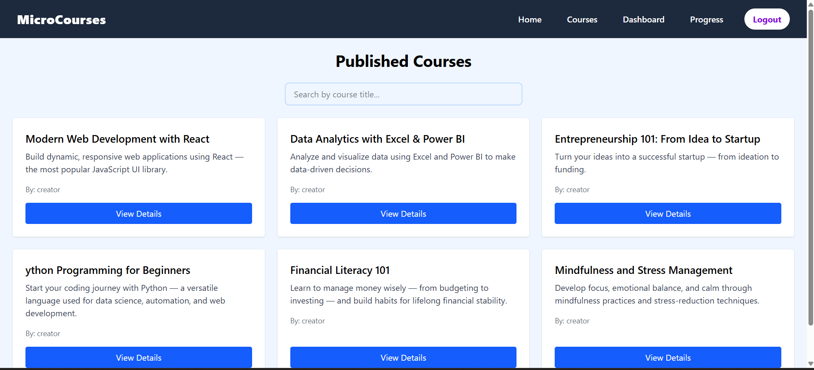

# MicroCourses — Mini LMS 

## Project overview

MicroCourses is a small Learning Management System (LMS) built as a single-page React application (Vite + Tailwind CSS) that works with an Express/MongoDB backend. It supports three roles: Learner, Creator, and Admin. The app demonstrates role-based pages, course and lesson creation, learner enrollment and progress tracking, and certificate issuance for completed courses.

Key frontend features:
- Login / Register with test credentials (displayed on the Login page)
- Role-based dashboards (Learner, Creator, Admin)
- Course listing, search and course details
- Creator flows: create course, add lessons (including transcript)
- Learner flows: enroll, play lessons, mark complete, view progress and certificates
- Admin flows: review and approve courses, view course stats

## Quick workflow 

- Visitor registers or logs in.
- Creator creates courses and adds lessons (includes transcript field).
- Learner views courses, enrolls, watches lessons, and marks lessons complete.
- System tracks enrollment progress; when a course is complete a certificate can be issued/viewed.
- Admin reviews newly submitted courses and approves them; approved courses are visible to learners.

## Frontend 

- Folder: `LMS/`
- Tech: React (Vite), Tailwind CSS, React Router
- Dev server: Vite (default port 5173)

## Backend 

- Folder in workspace: `LmsBackend/` (Express + Mongoose)
- Backend base URL (example used in frontend): `https://lmsbackend-e22.onrender.com` — replace with your deployed backend URL or local backend URL when running locally.

## Main API endpoints used by the frontend

Note: When endpoints require authentication, include a JWT either in header `x-auth-token` or `Authorization: Bearer <token>`.

- POST /auth/register — Register a new user
- POST /auth/login — Login (returns token + user)
- GET /auth/me — Get current user profile (requires auth)

- GET /courses — List courses (public)
- GET /courses/:id — Get course details (public)
- GET /courses/:id/progress — Get enrollment progress (auth)

- POST /creator/courses — Creator: create course (auth: Creator)
- GET /creator/courses — Creator: list their courses (auth: Creator)
- POST /creator/courses/:id/lessons — Creator: add lesson to course (includes `transcript`) (auth: Creator)

- POST /enroll/:courseId — Enroll a learner in a course (auth: Learner)
- GET /learn/:lessonId — Get lesson details (auth: Learner)
- POST /learn/:lessonId/complete — Mark a lesson complete (auth: Learner)

- POST /admin/courses/:id/approve — Admin: approve a course (auth: Admin)
- GET /admin/course/:id/stats — Admin: fetch course stats (auth: Admin)

- GET /certificates/:id — Get certificate details / view issued certificate (auth)

The backend may expose additional routes for analytics, uploads, and certificate generation; check the `LmsBackend/routes` folder for the full list.

## Environment variables

Backend (set these on your machine or hosting provider):
- `MONGO_URI` — MongoDB connection string
- `JWT_SECRET` — JWT signing secret
- `REDIS_URL` — (optional) Redis URL if using Redis features
- `PORT` — optional backend port

Frontend:
- If the frontend uses a Vite env var for API base url, set `VITE_API_URL` or update `src/api.js`'s BASE_URL to your backend URL.

## Install & run (PowerShell)

From the frontend folder (`LMS`):

```powershell
cd C:\Users\asus\Desktop\Shackthon\LMS
npm install
npm run dev
```

Open http://localhost:5173 in your browser.

From the backend folder (`LmsBackend`) — minimal example:

```powershell
cd C:\Users\asus\Desktop\Shackthon\LmsBackend
npm install
# run with node or nodemon (nodemon was included as dev dependency)
node index.js
# or if you have nodemon installed globally: nodemon index.js
```

Make sure the backend env vars are set before starting the backend.

## Packages 

Frontend (selected):
- react, react-dom, react-router-dom
- vite, tailwindcss, autoprefixer
- react-icons, lucide-react, react-chartjs-2

Backend (selected from `LmsBackend/package.json`):
- express, mongoose, jsonwebtoken, cors
- bcrypt / bcryptjs, dotenv
- redis (and rate-limit-redis) — if used for rate-limiting/idempotency

Run `npm install` in each folder to install the full set of packages listed in their respective `package.json` files.

## Live demo / deployment

If you deployed the frontend to a host (Netlify/Render/Vercel), paste the live URL here:

- Frontend live URL: https://learningmanager.netlify.app


## Test credentials (already displayed on the Login page)

- Admin: admin@gmail.com / admin123
- Creator: creator@gmail.com / 123456

## Screenshots (placeholders)


1. Creator Dashboard
   
2. Registration
   
3. Login
   
4. Progress
   
5. Course Details
   

Currently, two official plugins are available:

- [@vitejs/plugin-react](https://github.com/vitejs/vite-plugin-react/blob/main/packages/plugin-react) uses [Babel](https://babeljs.io/) for Fast Refresh
- [@vitejs/plugin-react-swc](https://github.com/vitejs/vite-plugin-react/blob/main/packages/plugin-react-swc) uses [SWC](https://swc.rs/) for Fast Refresh

